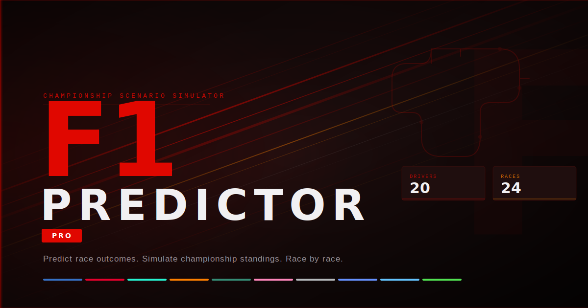

# F1 Predictor

An F1 championship scenario predictor — simulate upcoming race finishes via drag-and-drop and watch projected championship standings update in real time.



## Features

- **Drag-and-drop Race Simulator** — Assign drivers to finishing positions (1–22) for any upcoming race. Supports DNF, DNS, and DSQ statuses.
- **Sprint Race Support** — Separate sprint simulation with official sprint scoring (top 8).
- **Live Championship Projections** — Projected driver and constructor standings recalculate instantly as you build your predicted results.
- **Multi-Race Simulation** — Chain simulations across the entire remaining season to model full championship scenarios.
- **Championship Swing Analysis** — See exactly how many points each driver gains or loses relative to their rivals after your simulated race.
- **Title Watch** — Championship clinching math: see what combinations of results a driver needs to win the title.
- **Circuit Maps** — Interactive Leaflet map and 3D globe visualization for every circuit on the calendar.
- **Season Calendar** — Full race schedule with sprint weekend detection.
- **Share Scenarios** — Encode your simulation into a shareable URL.

## Tech Stack

| Layer | Technology |
|---|---|
| Framework | Next.js 16 (App Router) |
| UI | React 19 + Tailwind CSS 4 |
| State | Zustand 5 + Immer |
| Drag & Drop | @dnd-kit/core + @dnd-kit/sortable |
| Maps | Leaflet + react-leaflet |
| 3D Globe | globe.gl + Three.js |
| Language | TypeScript (strict) |
| Testing | Vitest + React Testing Library |
| Data | Jolpi/Ergast F1 API |

## Getting Started

### Prerequisites

- Node.js 20+
- npm

### Installation

```bash
git clone https://github.com/your-username/f1-predictor.git
cd f1-predictor
npm install
```

### Development

```bash
npm run dev
```

Open [http://localhost:3000](http://localhost:3000) in your browser.

### Other Commands

```bash
npm run build      # Production build
npm run lint       # Run ESLint
npm run test       # Run unit tests (Vitest)
npm run test:ui    # Run tests with interactive UI
```

## Project Structure

```
f1-predictor/
├── app/                    # Next.js App Router pages
│   ├── standings/          # Driver & constructor standings
│   ├── simulate/           # Multi-race simulator
│   ├── simulate/[round]/   # Round-specific drag-and-drop simulator
│   ├── maps/               # Circuit map visualization
│   ├── calendar/           # Season calendar
│   └── title/              # Championship clinching math
├── components/
│   ├── simulator/          # Drag-and-drop race UI components
│   ├── standings/          # Standings tables & driver profile drawer
│   ├── preview/            # Live projected standings panel
│   ├── maps/               # Circuit map & 3D globe components
│   └── ui/                 # Shared UI primitives (Button, Card, Badge, etc.)
├── lib/
│   ├── api/                # Server-side F1 data fetching & type mapping
│   └── f1/                 # Pure F1 business logic (points, standings, title math)
├── store/
│   └── simulationStore.ts  # Zustand store — all simulation state & derived standings
├── types/                  # TypeScript domain types & raw API shapes
└── constants/
    └── f1.ts               # Points tables, constructor colors, circuit data
```

## How It Works

1. **Data** — Server components fetch live standings and schedule from the [Jolpi/Ergast F1 API](https://api.jolpi.ca/ergast/f1) with ISR revalidation (standings: 1 hour, schedule: 24 hours).
2. **Simulate** — Users drag drivers into finishing positions in the client-side simulator. Each result is stored in a Zustand store keyed by round number.
3. **Project** — The store derives projected standings by applying all simulated race results on top of the current real-world baseline standings, using official F1 points rules.
4. **Share** — The current simulation state is encoded into URL parameters so scenarios can be shared.

## Data Source

Race data is sourced from the [Jolpi mirror of the Ergast F1 API](https://api.jolpi.ca/ergast/f1). This includes current season standings, race schedule, and completed race results.

## License

MIT
